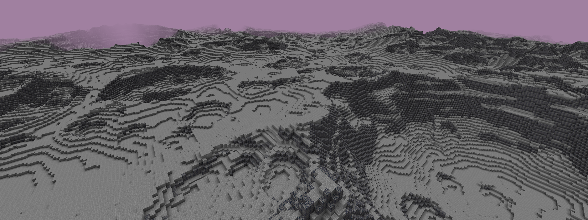
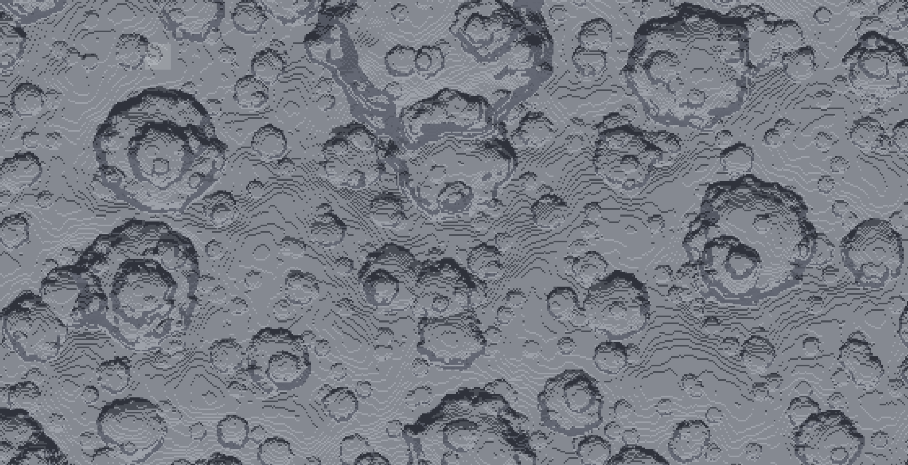
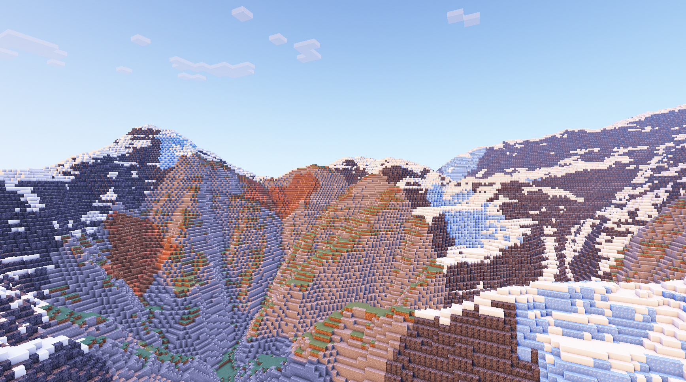
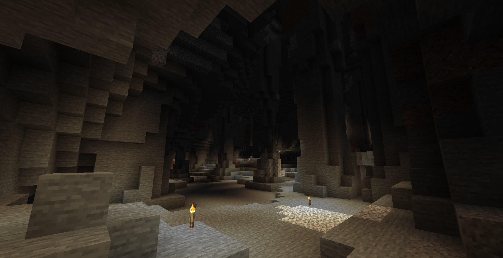

- [Full Packs](#full-packs)
    - [Default Config](#default-config)
    - [Default Nether](#default-nether)
    - [BetterEnd](#betterend)
- [Partial Packs](#partial-packs)
    - [Celestial Suite - MoonBasic](#celestial-suite---moonbasic)
    - [Valantis Terra Config](#valantis-terra-config)
- [Development Packs](#development-packs)
    - [Template Pack](#template-pack)
    - [Image Example Pack](#image-example-pack)
    - [CaveTest](#cavetest)

# Full Packs

> The following packs are intended as standalone configurations.

---

### Default Config

The default configuration that comes packaged with Terra.

`Author` - **dfsek**

`Download` - https://github.com/PolyhedralDev/TerraDefaultConfig/releases/download/latest/default.zip

`Source` - https://github.com/PolyhedralDev/TerraDefaultConfig/tree/master/default

---

### Default Nether

The default nether configuration that comes packaged with Terra.

```diff
! THIS PACK IS EARLY IN DEVELOPMENT AND SHOULD NOT BE USED IN PRODUCTION !
```

`Author` - **dfsek**

`Download` - https://github.com/PolyhedralDev/TerraDefaultConfig/releases/download/latest/nether.zip

`Source` - https://github.com/PolyhedralDev/TerraDefaultConfig/tree/master/nether

---

### BetterEnd

An End based Terra pack intended to replace the Spigot plugin
[BetterEnd](https://www.spigotmc.org/resources/betterend-rethink-the-end-dimension.79389/).

```diff
! THIS PACK IS EARLY IN DEVELOPMENT AND SHOULD NOT BE USED IN PRODUCTION !
```

`Author` - **dfsek**

`Source` - https://github.com/PolyhedralDev/TerraDefaultConfig/tree/master/betterend

---

# Partial Packs

> The following packs are intended to provide a small handful of content such as a few biomes, collections of structures,
> and or other miscellaneous configs.
> 
> Potential applications of partial packs may include:
> * Merging content such as biomes and structures into other packs.
> * Using the pack generation as a canvas for building.
> * Generating themed event worlds.
> 
> These packs may not contain enough content to warrant standalone use, and may require some knowledge of Terra
> configurations for applications like merging into other packs.

---

### Celestial Suite - MoonBasic

A simple pack for generating moon terrain.

`Author` - **Astrash**

`Tested versions` - **5.1.3**

`Source` - https://github.com/Astrashh/TerraCelestialSuite/tree/master/MoonBasic

<details>
<summary>Screenshots</summary><br>





</details>

---

### Valantis Terra Config

Contains a small selection of tropical themed biomes.

> NOTE -  *This pack is not survival friendly.*

`Author` - **Valantis**

`Tested versions` - **4.0.0**

`Source` - https://github.com/Valant1s/TerraConfig

<details>
<summary>Screenshots</summary><br>


</details>

---

# Development Packs

> The following packs are intended for assisting in pack development, and are not for use in production environments.

---

### Template Pack

A simple config pack intended to serve as the basis for pack development, complete with annotations explaining various
aspects of Terra configurations.

`Author` - **Astrash**

`Tested versions` - **4.3.0**

`Source` - https://github.com/Astrashh/TerraTemplatePack

---

### Image Example Pack

An example config pack intended to showcase the use of image noise samplers in both biome distribution, and noise
equations.

`Author` - **Astrash**

`Tested versions` - **5.1.3**

`Source` - https://github.com/Astrashh/ImageExamplePack

<details>
<summary>Screenshots</summary><br>




</details>

---

### CaveTest

An experimental pack centered around noise carvers. Intended for demonstration purposes, but could be adapted to be useable for regular gameplay.

`Author` - **Astrash**

`Tested versions` - **5.1.3**

`Source` - https://github.com/Astrashh/TerraCaveTest

<details>
<summary>Screenshots</summary><br>




</details>

---