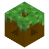

### Welcome to the Terra Wiki

---

#### What is Terra?

Terra is an incredibly powerful **free** & open-source data-driven, platform-agnostic world generator. It provides the tools
that allow you to create a world exactly to your specifications.

Terra is completely *config-defined*, meaning that it doesn't have any concept of what a forest, ocean, or even what a
cave is. This means Terra is capable of producing worlds unlike the traditional overworld, such as *new planets*, *alien
worlds*, *aether-like dimensions*, and much more! These concepts are all implemented through Terra's extensive
configuration system, meaning that the main limiting factor is the configuration itself.

Terra's config system is intuitive and *relatively* simple to learn, while also being the most powerful config system
yet seen in a
world generator.

Whether you're a server owner looking to spice up your server with out-of-the-box custom terrain, a developer looking to
tweak things to better fit your vision, or a creator looking to build completely new biomes or worlds from the ground up
, Terra can meet your world generation needs!

[//]: # (#Where can I see Terra in action?)
[//]: # (Need to make page for showcase)

#### How do I get started?

To get started with Terra, take a look at our [Quick Start Guide](./Quick-Start-Guide). It will walk you through
everything you need to get Terra working on your server, including installing the plugin and setting up a world with the
generator.

[//]: # (Everything here should probably be moved to another page)

---

### Community & Support

If you are unsure about anything or need clarification regarding Terra, you can contact us in our [Discord server](https://discord.gg/PXUEbbF)!

### Translated Wikis

#### Chinese

A Chinese translation of the Wiki can be found [here](https://mineplugin.org/Terra). Translation provided by qsefthuopq.
