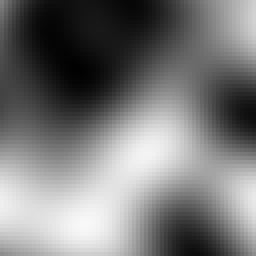

[//]: # (Noise configuration)

This page will explain some general technical concepts related to noise that are important to have an understanding of when developing configs.

- [What is noise?](#what-is-noise)
  - [Why is noise important?](#why-is-noise-important)
- [Noise Basics](#noise-basics)
  - [Demonstration](#demonstration)
  - [Determinism](#determinism)
  - [Seeds](#seeds)
  - [Flavors of Noise](#flavors-of-noise)
  - [Multidimensional Noise](#multidimensional-noise)
  - [Segmenting Noise](#segmenting-noise)
  - [Applying Noise to World Generation](#applying-noise-to-world-generation)
  - [Coherent Noise](#coherent-noise)
- [Manipulating Noise](#manipulating-noise)
  - [Frequency](#frequency)
  - [Fractal Noise](#fractal-noise)
  - [Domain Warping](#domain-warping)


### What is noise?

In Terra, noise does does not refer to sound you can hear, but rather a series of [randomly](https://en.wikipedia.org/wiki/Pseudorandom_number_generator)* generated values. These values are produced by something *we will call* a **noise function** - which is just a fancy algorithm that converts an input into a randomized numeric output.

```none
┌──────────────────┐    ┌────────────────┐    ┌───────────────────┐
│ Input parameters │ →  > Noise Function >  → │ Randomized output │
└──────────────────┘    └────────────────┘    │   (aka 'noise')   │
                                              └───────────────────┘
```

#### Why is noise important?

Noise is a central concept in Terra, because just about every random aspect of world generation is influenced by noise to some degree. Having a basic understanding of noise and how to manipulate it will give you insight into how worlds are randomly generated by Terra, and is an important skill to have if you want to develop your own config packs.

Before learning how to manipulate noise, you should first have an understanding of the underlying concepts outlined here. Don't worry, we won't throw anything *too complicated* at you for now! Having a firm grasp on noise will bring you closer to controlling exactly how world generation will behave, which is why having a foundational understanding is important.

Here is just a short of list of things heavily influenced by noise in Terra:

* The placement of biomes in the world.
* How terrain is shaped.
* How flora and trees are distributed.


### Noise Basics

Here we will cover some key points is grasping noise in Terra. If you feel like certain concepts are too difficult to understand, feel free to skim over them for now, and revisit them later.

#### Demonstration

Let's begin with a demonstration displaying the most basic process of 'creating' noise. We will use a theoretical implementation of a noise function called [*white noise*](https://en.wikipedia.org/wiki/White_noise), and generate some values with it. Explaining how exactly our *white noise* function creates these values is outside the scope of this guide, however is not essential in understanding the general idea.

 We will perform a couple samples with our function, using numbers 1 - 10 as an input, and record the outputs as both a number and a shade from black to white (where -1 is black, and 1 is white). We will also round the output to one decimal place for simplicity. *(Typical outputs will produce decimals with **much higher** precision than just one decimal place!)*

###### MODEL

```none
┌────────────────────┐   ┌─────────────┐   ┌───────────────────┐
│  Input parameters  │ → > White Noise > → │ Randomized output │
├────────────────────┤   │   Function  │   └───────────────────┘
│ Number from 1 - 10 │   └─────────────┘
└────────────────────┘
```

###### RESULTS


Simple, right? All our noise function does is convert one value to another. You can think of noise functions like a little number machine that takes an input and scrambles it around to produce an output.

###### SIDENOTE

> Input numbers do not have to be whole numbers! This means you can input numbers like `1.5` and noise functions will work still the same way. We've just used integers here for the sake of demonstration.


#### Determinism

One requirement of Terra noise functions is that the output must be *deterministic*, meaning given any input, the output must always be the same. This means we can reliably re-produce any 'random' results we get from noise functions by feeding it the same input.

Going off the results above, when passing the number `5` to our *white noise* function, we will always get the number `0.4` back.

#### Seeds

Sometimes, we want to use the same input, and same noise function, but for multiple random unique outputs. In that case, we can use a seed in our noise function. Seeds are basically a way of getting a whole new uncorrelated set of random values from the same inputs + noise function. Unlike the input value, seeds must be a whole number, meaning `5324` would be a valid seed, but `231.23` would not.

Expanding on our basic model of noise generation we have:

```none
┌──────────────────┐   ┌────────────────┐   ┌───────────────────┐
│ Input parameters │ → > Noise Function > → │ Randomized output │
├──────────────────┤   └────────────────┘   └───────────────────┘
│ - Seed           │
│ - Input value    │
└──────────────────┘
```

Here is an example using two different seeds to produce different outputs, using the same inputs and noise function from the example above.


One example of using seeds that you might be familiar with is the minecraft world seed. A vanilla minecraft world seed gets inserted into the many different noise functions that govern vanilla world generation, resulting in completely different worlds per seed, since each noise function will return a completely new set of values.

###### VANILLA BEDROCK GENERATION TRIVIA

> Some noise functions in vanilla generation use the same seed for every world (meaning they don't factor in the world seed), which can result in every world generating a certain characteristic the exact same way. One notable example - the function that controls bedrock formation uses a static seed for every world, leading every vanilla generated world  to share the same random configuration of bedrock.

Within Terra world generation, all* noise functions use a combination of the world seed and a value called **salt**, to determine its own seed. Salt is a number you specify when defining noise configurations, and simply gets added to the world seed. This allows individual noise configurations to use new sets of output values, while sharing the same base noise function.

#### Flavors of Noise

There are many different variants and implementations of noise functions, such as our *white noise* function above. Each has their own quirks, behaviours, and applications, however in general they all follow the same basic principles outlined here. We will cover a couple of these variants later down the line.

Here is a small list of notable noise functions that are commonly used in Terra:

* Simplex Noise
* Cellular / Voronoi / Worley Noise
* White Noise
* Value Noise

#### Multidimensional Noise

The phrase 'multidimensional noise' may sound intimidating, but don't worry, it's a fairly simple concept to understand. Simply put, multidimensional noise involves providing **multiple** input values, rather than just one. In every example thus far, we have only provided one value for each noise *'sample'* (excluding the seed), meaning we are conceptually only sampling in one dimension, however we can go further.

The simplest example of multidimensional noise is just adding one extra input to our noise function, for a grand total of 2 inputs. Conveniently, that gives us 2 dimensions, thus we can easily display a set of 2D samples in a grid. We will refer to the first input as `X`, and the second as `Z`.

In a new example, let's use a range of 1 - 3 for both `X` and `Z`, giving us a total of 9 samples (3 x 3). We will only label the `X` & `Z` axes, as well the reference point `X = 0`, `Z = 0` for the sake of simplicity.

###### TWO DIMENSIONAL MODEL

```none
┌──────────────────┐   ┌─────────────┐   ┌───────────────────┐
│ Input parameters │ → > White Noise > → │ Randomized output │
├──────────────────┤   │   Function  │   ├───────────────────┤
│ - Seed           │   └─────────────┘   │ Displayed as as a │
| - Input 1 (X)    |                     │ 2D grid of shades │
| - Input 2 (Z)    |                     └───────────────────┘
└──────────────────┘
```

###### RESULTS


As you can see, all we have done is add another dimension to our white noise function, allowing for noise to be depicted as a 2D grid, rather than a list of values.

Taking this experiment further, let's use a larger sample size. This time we will sample a grid of 64 x 64 points, where each sample will be represented as a single pixel.


What we have done here is essentially produced a random image using our *white noise* function. By default, we will assume the above format of visualizing noise in 2D as an image.

###### HIGHER DIMENSIONS

Many noise algorithms support an arbitrary amount of inputs, meaning that we can sample noise in any number of dimensions. Typically, we will only use up to three dimensions in Terra, where each input corresponds to the position on each axis `X`, `Y`, and `Z`.

#### Segmenting Noise

[Segmentation](https://en.wikipedia.org/wiki/Image_segmentation) in this context refers to splitting a set of values into several parts based on the range each value fits in to.

> This is not a concept specific to noise, but is something to keep in mind, as it is commonly used in conjunction with noise and world generation.

The simplest form of segmentation is **thresholding**, which simply involves *separating a set of values into two groups based on whether they're higher or lower than a number*. An example of thresholding would be outputting a value of `-1` for input values less than `0`, and outputting a value of `1` for every other input, however the output could be anything, such as `true / false` depending on use.

Applying a threshold to every pixel of an image where `input = intensity of the pixel`, `output = either a black or white pixel`, and `threshold = 50%`, we get the following result:


###### AS A MATH FUNCTION

> We can represent thresholding mathematically as a [piecewise](https://en.wikipedia.org/wiki/Piecewise) function:
> ```
> f(x) =
> {
>   -1   if   x <  threshold
>    1   if   x >= threshold
> }
> ```
> Most applications of segmentation in Terra are essentially fancy piecewise functions like the one above, written programmatically.

Segmentation is a useful concept to understand when combined with noise, as it allows us to split noise functions into distinct values. We will cover an example of segmented noise and an application of it in the following section.

#### Applying Noise to World Generation

You might be wondering: *How does this information translate to generating an entire world?* Before we jump straight from simple noise generation to generating entire worlds, let's just keep it simple and apply the knowledge we've covered thus far to a simple application.

###### PLANTING GRASS

Let's say we have a patch of land, and we want to generate some tall grass on it, but how would we determine where the grass goes? The first thing we will want to do is define some basic rules for generating grass, before we get to the part where noise is involved:

- `Grass` may only generate on top of `grass blocks`.
- `Grass` may only replace `air`.

Simple enough, now we know that grass will only generate where appropriate. With only these rules however, we would end up with grass on top of every single grass block! What if we only wanted it on *some* grass blocks? Well we can use our *white noise* function for that!

Let's feed our *X & Z world coordinates & seed* into our *2D white noise* function, which will give us a randomized output value (from -1 to 1 as discussed) for every X-Z column for any given world seed. We will then use that output value to determine whether we place some grass or not. The way this will be determined is by simply [thresholding](#segmenting-noise) it! We'll start with a threshold of `0`, where any value below our threshold will mean **`place grass`**.

###### GRASS PLACEMENT MODEL

```none
┌──────────────────┐   ┌─────────────┐   ┌───────────────────┐   ┌─────────────────────────┐
│ Input parameters │ → > White Noise > → │ Randomized output │ → >   Threshold Function    │
├──────────────────┤   │   Function  │   ├───────────────────┤   ├─────────────────────────┤
│ - World Seed     │   └─────────────┘   │   A value from    │   │ If below the threshold, │
| - X Coordinate   │                     │     -1 to 1       │   │ place grass. (Displayed │
| - Z Coordinate   │                     └───────────────────┘   │   as a green pixel)     │
└──────────────────┘                                             └─────────────────────────┘
```

###### RESULTS


As you can see, we now have a method of randomly determining if grass should be placed or not for any given [X-Z coordinate](#multidimensional-noise) in [any world](#seeds). We can even reduce / increase how much grass we get by modifying our threshold value:

`Threshold = -0.25`


Lowering the threshold from `0` to `-0.25` results in less grass because we are effectively removing the values between `-0.25` and `0` from falling below the threshold. Conversely, *increasing* the threshold will result in more grass, as more values will fall below the threshold.

Combining this with our rules we established earlier, we now have a method of checking for any block whether it should be grass or not.


#### Coherent Noise

Thus far, we have only covered noise that outputs seemingly random tv-static-like values, which is fine for simple applications like the grass example above. But how can we get noise capable of producing smooth rolling hills, vast mountains, and other structured random generation? Let's place the white noise function under the category **'random noise'**, and introduce a new category of noise functions called **'coherent noise'**.

###### WHAT'S THE DIFFERENCE?

The main difference that separates *random noise* from *coherent noise* is that while random noise functions produce noise with no apparent structure, coherent noise functions produce *'structured'* noise, where adjacent input values produce correlated output values.

To get a better idea of the difference, here is a visualization of two different 2D sampled noise functions that both share the same inputs:

`Random | Coherent`


As you can see, the coherent noise example has a discernible structure where output values are smooth, compared to the random noise example where there's no apparent structure. The coherent noise function used above is known as **Simplex noise**, and is one of the many flavours of noise provided in Terra.

### Manipulating Noise

Now that we have covered some essential topics regarding noise, let's talk about stretching, squishing, tweaking, and remixing it!


#### Frequency

You might be wondering how we control just how large or how small details produced by noise functions are. This is where the concept of **frequency** comes in. Frequency is a number that modifies the scale of noise, where higher frequency produces more 'zoomed out' noise, while lower frequency results in more 'zoomed in' noise.

Let's preview some comparisons of the same noise function with varying frequencies:

 `2x Frequency | 1x Frequency | 0.5x frequency`


As a general rule of thumb:

###### HIGHER FREQUENCY

* Zooms *out*.
* Produces *smaller* & *closer* details.
* Increases the density of 'points' per unit of space.

###### LOWER FREQUENCY

* Zooms *in*.
* Produces *larger* & *more spread out* details.
* Decreases the density of 'points' per unit of space.

<details>

<summary><b>Under The Hood</b> - How frequency works</summary><br>

The driving math behind frequencies is very simple: *multiply the input coordinates of a noise function by the frequency*. Here is a model of the process:

```none
┌──────────────────┐                     ┌────────────────┐   ┌───────────────────┐
│ Input parameters │          ╭──────┬ → > Noise Function > → │ Randomized output │
├──────────────────┤          │      │   └────────────────┘   └───────────────────┘
│ - Seed           > ─────────╯      │
│ - Frequency      > ─────────╮      │
| - Input 1 (X)    > → X * Frequency ┤
| - Input 2 (Z)    > → Y * Frequency ╯
└──────────────────┘
```

For example, if we have a frequency of `2`, and want to sample the coordinates `(X = 3, Z = 2)`, first the coordinates will be multiplied by the frequency `2`, giving us the scaled coordinates `(X' = 6, Z' = 4)`. This new set of coordinates will then be input into the noise function which will then give us the final output value.

> Based on this logic, we can deduct that the input:
>
> `(X = 3, Z = 2, Frequency = 2)`
>
> Will give the exact same output when inputting:
>
> `(X = 6, Z = 4, Frequency = 1)`

Higher frequencies effectively produce *faster changes* when incrementing input coordinates, which is why higher frequencies make details closer and therefore smaller.

</details>

#### Fractal Noise

In some situations, [Coherent Noise](#coherent-noise) on its own may be far too smooth and uniform to produce '*realistic*' results. Looking at the images above, you may notice that they are quite *blobby*, which may not be desired for applications where more detail is required. This is where **fractal noise** comes in.

The basic premise of fractal noise that we can produce more detail by stacking multiple of the same noise function on top of each other, where each successive function (called an **octave**) has a smaller [frequency](#frequency) and is weaker (see: [Range & Amplitude](#range--amplitude)). This process of progressively stacking incrementally smaller noise to produce a [fractal](https://en.wikipedia.org/wiki/Fractal) effect is referred to as [fractal Brownian motion](https://en.wikipedia.org/wiki/Fractional_Brownian_motion) (Commonly abreviated as fBm).

It might sound quite complicated in writing, so we can demonstrate this concept visually to get a better idea of what's happening:

`1 Octave (Regular Noise) | 2 Octaves | 3 Octaves | 4 Octaves`


As you can see, the more octaves we add, the more detailed the noise gets. This is the main application of fractal noise: to produce more detail, especially at lower frequencies where detail is sparse.

#### Domain Warping


Similar to fractal noise, domain warping involves manipulating the input *aka the **domain***, before it's passed to the noise function. More specifically, the domain of a noise function will be warped via translation by the output of a secondary warping function.

To demonstrate domain warping more clearly, let's take a 64 x 64 square of samples in a space. Our function *to be warped* will be a checkerboard pattern, and our *warping function* will be some basic simplex noise.




When domain warping the checker board function by the simplex we get the following result:


As you can see, our once perfectly square boxes have been contorted out of shape by the warp function.

<details>

<summary><b>Under The Hood</b> - The Math Behind Domain Warping</summary><br>

To get a better idea of what's happening, let's better define the process:
> 
> * We will define `noise(coordinate)` as our function to be warped, where `coordinate` represents the input values (such as the familiar `X` and `Z` coordinates).
> 
> * To *translate* `noise`, we can simply add some translation to the input: `noise(coordinate + translation)`. Translating simply means moving left / right / up / down / etc.
> 
> * We can then define `warp_noise(coordinate)` as our warping function.
> 
> * If we make `translation` our `warp_noise` function then now the `coordinate` of `noise` will be translated by `warp_noise` like so:
> 
>     `noise(coordinate + warp_noise(coordinate))`
>
> * Finally, we can multiply the output of `warp_noise` by a value `amplitude`, which will control how 'strong' the warping will be, to give us the final formula:
> 
>     `noise(coordinate + warp_noise(coordinate) * amplitude)`

</details>

#### Range & Amplitude

It will be valuable to define the terms [*range*](https://en.wikipedia.org/wiki/Range_of_a_function) and [*amplitude*](https://en.wikipedia.org/wiki/Amplitude) in relation to noise to better understand what your noise is doing.

Range simply refers to the minimum and maximum a noise function can output. As explained earlier on, conventionally noise functions output values between `-1` and `1`, meaning that the **range** of a typical noise function is `[-1, 1]`. It's important to note that this isn't always the case and sometimes the 

Amplitude simply refers to how large the output of a noise function can be.  The amplitude of noise functions may be modified, usually during the process of calculations (either made internally by Terra, or externally via configuration).


Remember that the number of octaves is the number of noise functions stacked on top of each other, and each additional
function has a lower frequency, and is weighted lower.   
Terra uses Simplex Fractal noise for erosion and terrain generation.