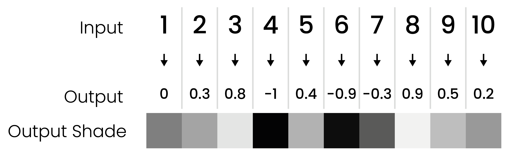
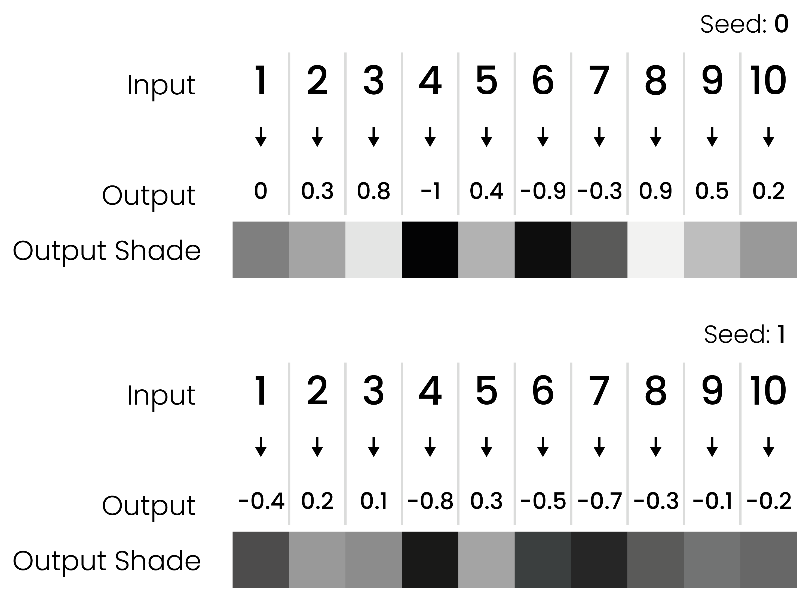
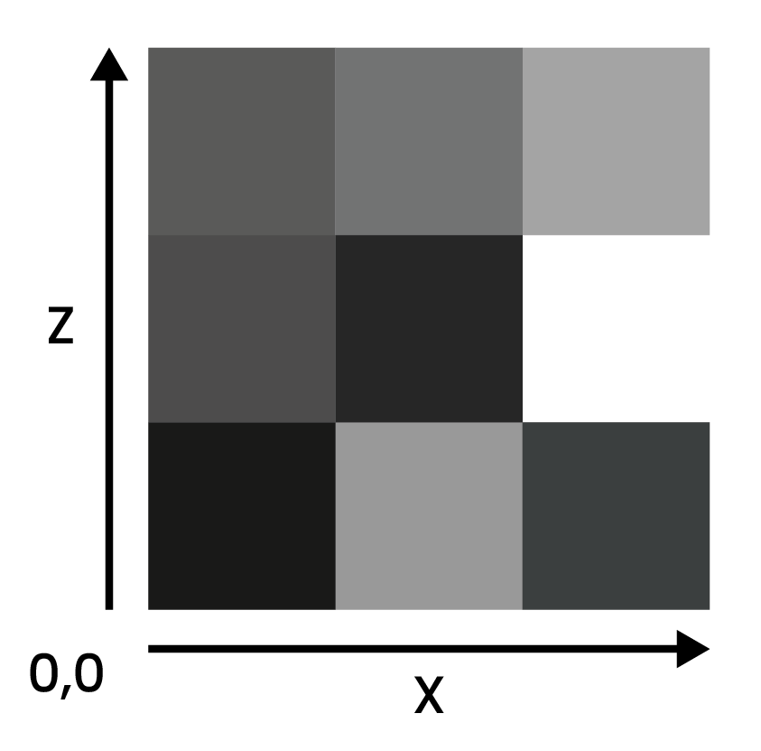

[//]: # (Noise configuration)

This page will explain some general technical concepts related to noise that are important to have an understanding of when developing configs.

# What is noise?

In Terra, noise does does not refer to sound you can hear, but rather a series of [randomly](https://en.wikipedia.org/wiki/Pseudorandom_number_generator)* generated values. These values are produced by something called a *noise function* - which is just a fancy algorithm that converts an input into a randomized numeric output.

```none
┌──────────────────┐    ┌────────────────┐    ┌───────────────────┐
│ Input parameters │ →  > Noise Function >  → │ Randomized output │
└──────────────────┘    └────────────────┘    │   (aka 'noise')   │
                                              └───────────────────┘
```

##### WHY IS NOISE IMPORTANT?

Noise is a central concept in Terra, because just about every random aspect of world generation is influenced by noise to some degree. Having a basic understanding of noise and how to manipulate it will give you insight into how worlds are randomly generated by Terra, and is an important skill to have if you want to develop your own config packs.

Before learning how to manipulate noise, you should first have an understanding of the underlying concepts outlined here. Don't worry, we won't throw anything *too complicated* at you for now! Having a firm grasp on noise will bring you closer to controlling exactly how world generation will behave, which is why having a foundational understanding is important.

Here is just a short of list of things heavily influenced by noise in Terra:

* The placement of biomes in the world.
* How terrain is shaped.
* How flora and trees are distributed.


##### BASIC NOISE EXAMPLE

Let's use a theoretical implementation of a noise function called [*white noise*](https://en.wikipedia.org/wiki/White_noise), and generate some values with it. We will perform a couple samples with our function, using numbers 1 - 10 as an input, and record the outputs as both a number and a shade from black to white (where -1 is black, and 1 is white). We will also round the output to one decimal place for simplicity. *(Typical outputs will produce decimals with **much higher** precision than just one decimal place!)*

###### MODEL
```none
┌────────────────────┐   ┌─────────────┐   ┌───────────────────┐
│  Input parameters  │ → > White Noise > → │ Randomized output │
├────────────────────┤   │   Function  │   └───────────────────┘
│ Number from 1 - 10 │   └─────────────┘
└────────────────────┘
```

###### RESULTS



Simple, right? All our noise function does is convert one value to another.

##### MORE ON NOISE BASICS

One requirement of noise functions is that the output must be *deterministic*, meaning given any input, the output must always be the same. This means we can reliably re-produce any 'random' results we get from noise functions by feeding it the same input.

Something to note is that there are many different variants and implementations of noise functions, such as our *white noise* function above. Each has their own quirks, behaviours, and applications, however in general they all follow the same basic principles outlined here. We will cover a couple of these variants later down the line.

Here is a small list of notable noise functions that are commonly used in Terra:

* Simplex Noise
* Cellular / Voronoi / Worley Noise
* White Noise
* Value Noise

##### SEEDS

Sometimes, we want to use the same input, and same noise function, but for multiple random unique outputs. In that case, we can use a seed in our noise function. Seeds are basically a way of getting a whole new set of uncorrelated random values from the same inputs + noise function.

Expanding on our basic model of noise generation we have:

```none
┌──────────────────┐   ┌────────────────┐   ┌───────────────────┐
│ Input parameters │ → > Noise Function > → │ Randomized output │
├──────────────────┤   └────────────────┘   └───────────────────┘
│ - Seed           │
│ - Input value    │
└──────────────────┘
```

Here is a basic example using two different seeds to produce different outputs, using the same inputs and noise function from the example above.



One example of using seeds that you might be familiar with is the minecraft world seed. A vanilla minecraft world seed gets inserted into the many different noise functions that govern vanilla world generation, resulting in completely different worlds per seed, since each noise function will return a completely new set of values.

###### VANILLA BEDROCK GENERATION TRIVIA

> Some noise functions in vanilla generation use the same seed for every world (meaning they don't factor in the world seed), which can result in every world generating a certain characteristic the exact same way. One notable example - the function that controls bedrock formation uses a static seed for every world, leading every vanilla generated world  to share the same random configuration of bedrock.

Within Terra world generation, all* noise functions use a combination of the world seed and a value called **salt**, to determine its own seed. Salt is a number you specify when defining noise configurations, and simply gets added to the world seed. This allows individual noise configurations to use new sets of output values, while sharing the same base noise function.

##### MULTIDIMENSIONAL NOISE

The phrase 'multidimensional noise' may sound intimidating, but don't worry, it's a fairly simple concept to understand. Simply put, multidimensional noise involves providing **multiple** input values, rather than just one. In every example thus far, we have only provided one value for each noise *'sample'* (excluding the seed), meaning we are conceptually only sampling in one dimension, however we can go further.

The simplest example of multidimensional noise is just adding one extra input to our noise function, for a grand total of 2 inputs. Conveniently, that gives us 2 dimensions, thus we can easily display a set of 2D samples in a grid. We will refer to the first input as `X`, and the second as `Y`.

In a new example, lets use a range of 1 - 3 for both `X` and `Y`, giving us a total of 9 samples (3 x 3):

###### TWO DIMENSIONAL MODEL

```none
┌─────────────────────┐   ┌─────────────┐   ┌───────────────────┐
│ Input parameters    │ → > White Noise > → │ Randomized output │
├─────────────────────┤   │   Function  │   ├───────────────────┤
│ - Seed              │   └─────────────┘   │ Displayed as as a │
| - Input 1 (X) (1-3) |                     │ 2D grid of shades │
| - Input 2 (Y) (1-3) |                     └───────────────────┘
└─────────────────────┘
```

###### RESULTS



> Many noise algorithms support an arbitrary amount of inputs, meaning that we can sample noise in any number of dimensions.

## Gradient Noise

A gradient noise function is a mathematical formula to produce consistent pseudorandom values based on input
coordinates, with gradients between points. Identical noise functions with the same seed will always produce the same
values for a pair of coordinates.
## Simplex Noise
Simplex is a gradient noise function created by Ken Perlin to address the limitations in his older noise function,
Perlin noise. Simplex is more performant than Perlin noise, especially in higher dimensions, and has fewer artifacts.
Terra uses redistributed, normalized Simplex noise for [biome selection](./Biome-Selection).
Here's an example of Simplex noise:   
   
Each point on the image has a grayscale value equal to the value of the noise function at the image coordinates.
As you can see, the values are pseudorandom, yet gradients exist between them.

### Frequency
Frequency is the amount that changes in coordinates affect changes in noise levels. Essentially, frequency can be
thought of as "zooming" th noise in or out. Here are some examples:    

* Frequency: 0.005:   
   

* Frequency: 0.01:   
  

* Frequency: 0.02:   
   


As the frequency increases, the noise "zooms out," resulting in faster changes.
## Simplex Fractal Noise
In some applications, Simplex noise is too smooth to produce "realistic" results. Looking at the images above, you may
notice that they are quite "blobby." In some cases, more randomness is desirable. This is where Simplex Fractal noise
is useful. Simplex Fractal noise stacks a number of Simplex noise functions at different frequencies on top of each
other, to produce a noisier result.

* 1 Octave:   
   

* 2 Octaves:   
   

* 3 Octaves:   
   

* 4 Octaves:   
   


Remember that the number of octaves is the number of noise functions stacked on top of each other, and each additional
function has a lower frequency, and is weighted lower.   
Terra uses Simplex Fractal noise for erosion and terrain generation.