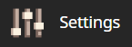
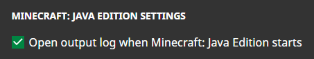
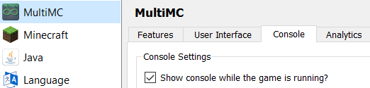
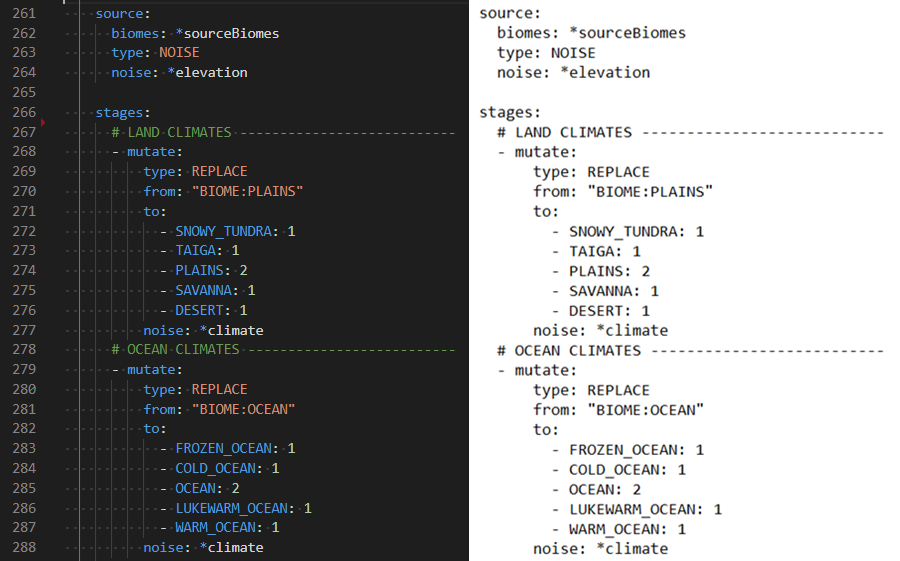
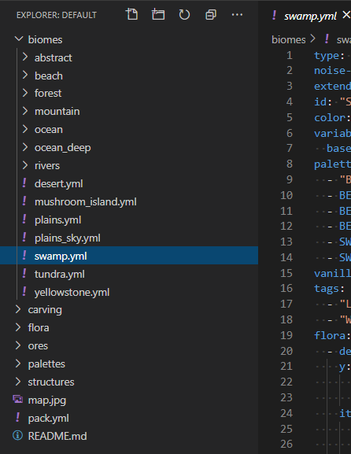

This guide will outline the process of creating a new Terra configuration pack from scratch. If you haven't already, check out [Config Packs](./Config-Packs) for more information about config packs before continuing.

- [Preparation](#preparation)
    - [Setting Up Your Test Environment](#setting-up-your-test-environment)
      - [Enabling Debug Mode](#enabling-debug-mode)
      - [Accessing Console](#accessing-console)
    - [Picking a Text Editor](#picking-a-text-editor)
      - [Recommended Editors](#recommended-editors)
- [Setting up a New Pack](#setting-up-a-new-pack)
      - [Let's Recap](#lets-recap)
    - [Onwards!](#onwards)

While Terra has a very intuitive config system, this does **not** mean creating a decent config is a simple task!
Procedural world generation contains a lot of moving parts and can get quite complex depending on how specific you want to get. This guide will provide a foundation of knowledge required to build your own world generator in Terra from scratch, while remaining as beginner friendly as possible. If you get stuck at any stage, or need some clarification, be sure to
**ask for help** if you need it! We'll be happy to help you in our [Discord server](https://discord.gg/PXUEbbF).

# Preparation

This section goes over the basic setup preceding actual config pack development, including setting up a test server / client and an appropriate development workspace.

### Setting Up Your Test Environment

Before beginning development on a new pack, you will need a suitable server or client to test with. We recommend using a [Fabric](https://fabricmc.net/) client to develop config packs on, however this choice is up to you. You can refer to the [Quick Start Guide](./Quick-Start-Guide) to find instructions on how to set up Terra for each platform.

```diff
! Do not follow the following steps on any live production environment !
```

#### Enabling Debug Mode

Once you have Terra running on your platform of choice, you will need to enable debug mode in order to access the relevant development tools.

To enable debug mode, you must first navigate to the Terra configuration file. This will be located inside a subdirectory contained inside your client / server directory *(You should already know where this is if you have already installed Terra!)*. The location will depend on what platform your test server / client is running on:

* For Forge & Fabric - `/config/Terra/config.yml`

* For Bukkit - `/plugins/Terra/config.yml`

Once you have located the Terra configuration file, open in a text editor, and set debug to true like so:

```yaml
debug: true
```

#### Accessing Console

Once you have enabled debug mode, you should also ensure you have access to your console. Again this will be dependent on the platform you're running Terra on, as well as the launcher or wrapper you start it from. We won't be covering how to find the console on every platform as that is outside the scope of this guide.

<details>
<summary><u>Mojang Minecraft Launcher</u></summary>

1. Start the launcher and navigate to the settings page by clicking on this button in the bottom left:

    

2. Enable displaying the output log on game startup here:

    

3. A window with the console log will now open when you start Minecraft.

</details>

<details>

<summary><u>MultiMC Launcher</u></summary>

1. Open up the MultiMC settings window

2. Enable console log display on launch:

    

3. A window with the console log will now open when you start Minecraft.

</details>

### Picking a Text Editor

When developing config packs, a text editor will be the main tool you'll use, so it's important that you use a suitable one for the job. You're free to use any text editor you're comfortable with, but we *highly* suggest using one with the following features:

<details>

<summary><u>YAML Syntax Highlighting</u></summary><br>

> Having syntax highlighting in a text editor will make understanding and writing configs much easer, as you will be able to tell at a glance how things are structured. To emphasize the point, here is a comparison of a config with and without syntax highlighting:
> 
> `Syntax Highlighting | No Syntax Highlighting`
>
> 

</details>

<details>

<summary><u>Built In File Explorer</u></summary><br>

> Using a text editor which lets you open entire folders as projects rather than just individual files will make pack development more streamlined and convenient. The ability to quickly swap between configs, view your pack hierarchy at a glance, and manage subdirectories within your text editor is a must if you want to get things done conveniently. This will save you plenty of time not having to manage both an external file explorer on top of text editor tabs and or instances.
> 
> 

</details>

#### Recommended Editors

- [**VSCode**](https://code.visualstudio.com/)

- [**IntelliJ IDEA Community Edition**](https://www.jetbrains.com/idea/download/)

# Setting up a New Pack


1. Duplicate an existing pack to serve as a template:

    1. Navigate to the packs directory located at `plugins/Terra/packs`

    2. Extract the contents of the `default.zip` directory into a new folder.

        ###### TEMPLATE PACK

        > Alternatively you can use the template configuration pack provided by Astrash, which provides minimal
        configurations and annotated explanations. The GitHub repository can be found
        [here](https://github.com/Astrashh/TerraTemplatePack).

    3. Rename this new folder whatever want, this tutorial will call the new config folder `example`.

2. Open the new pack directory in a text editor of your choice.

3. Set up an ID for your new pack:

    1. In your text editor, open up `pack.yml`, found in the root directory of the new config pack.

    2. Within `pack.yml`, Change the `id` to the ID you wish to assign your
config, as well as the `author` to your username like so:

    ```yaml
    id: EXAMPLE_ID
    # Replace 'EXAMPLE_ID' with your desired pack ID

    author: dfsek
    # Replace 'dfsek' with your username
    ```

6. Configure your test server's world to use the new config as a generator:
    1. Open `bukkit.yml` (Found in the root of the server).

    2. Assign your new generator to the default world  by **adding the following lines to the
    end of the file**:

    ```yaml
    worlds:
      <LEVEL NAME>: # The name of this can be found in the 'server.properties' under
                    # the 'level-name' key. By default, level-name is set to 'world'.
        generator: Terra:EXAMPLE
        # Replace 'EXAMPLE' with the ID of your config.
    ```

7. Stop your test server, delete the `world` folder, and start your server again. Your test server will now be using
your new config pack!

#### Let's Recap

* You now have a copy of the default / template config, called `EXAMPLE`.

* The pack is running on your test server, and the default world is assigned to the
generate using the pack.

* You have a workspace in a [suitable text-editor](#editor-tip) set up to work on this new config.

### Onwards!

Once you have successfully set up your own Terra config pack, you may continue to the
[Configuring Your Pack](./Configuring-Your-Pack) page, where we will cover pack configuration.
